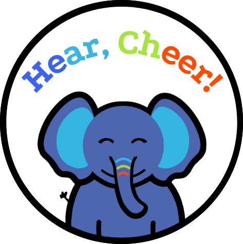
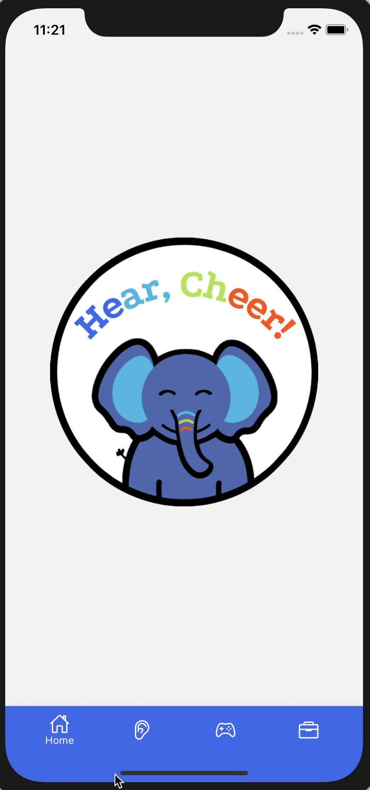
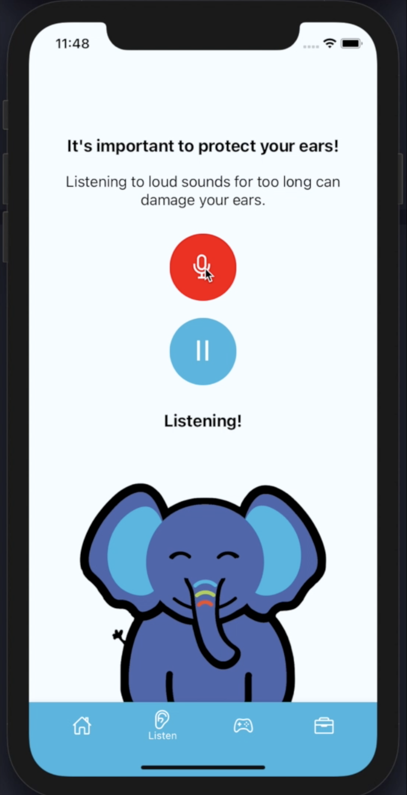
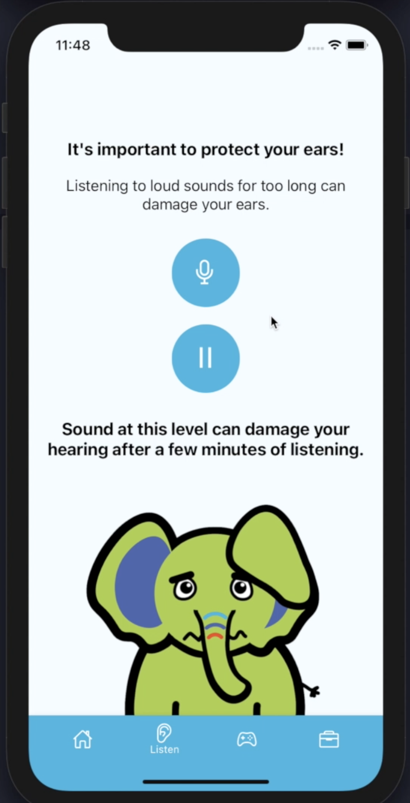
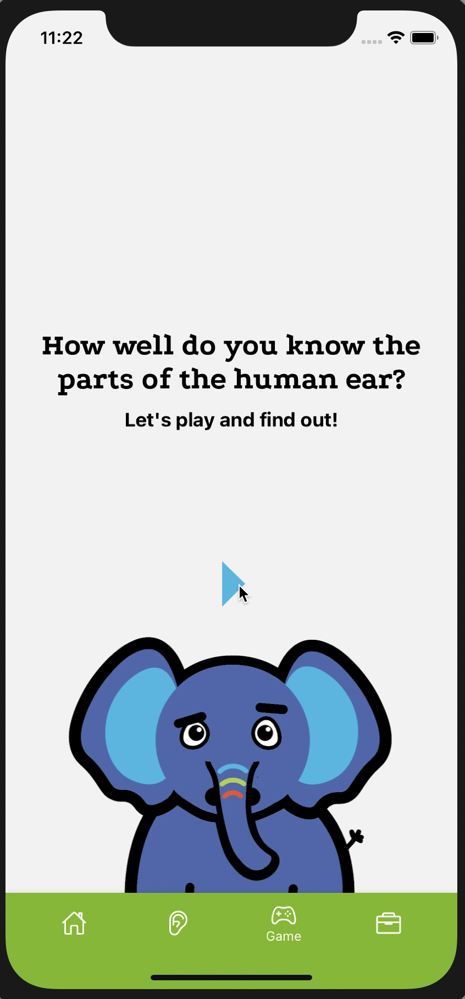
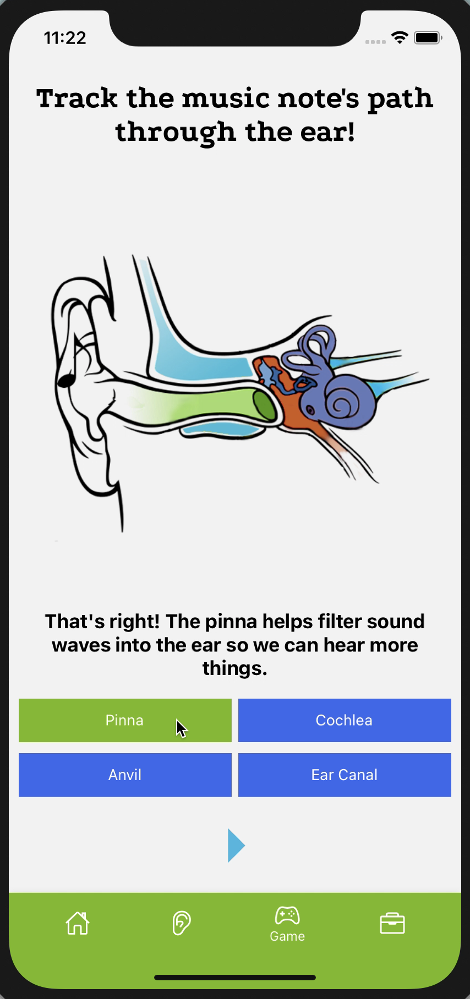
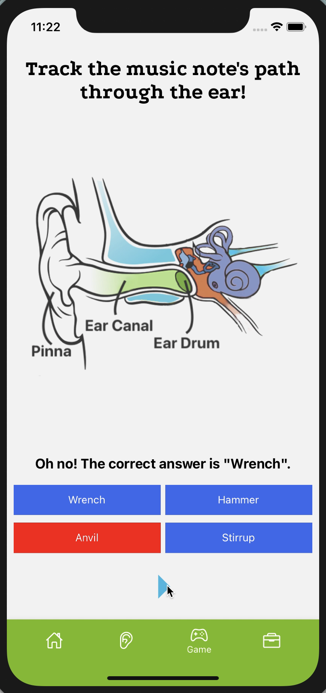
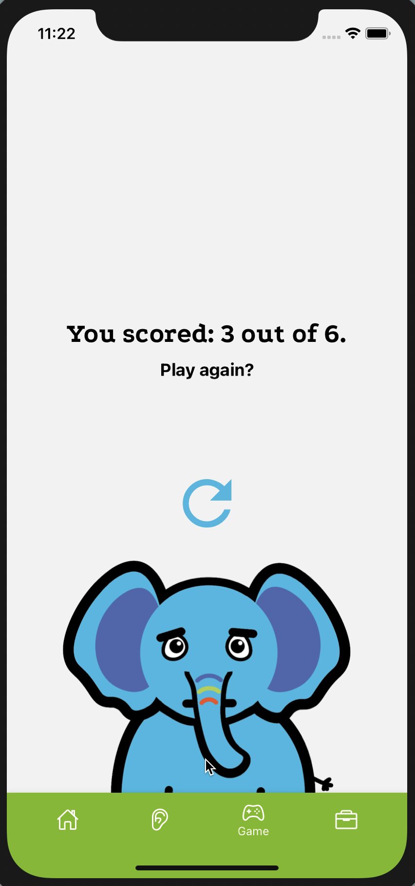
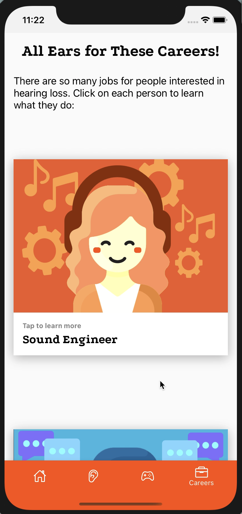
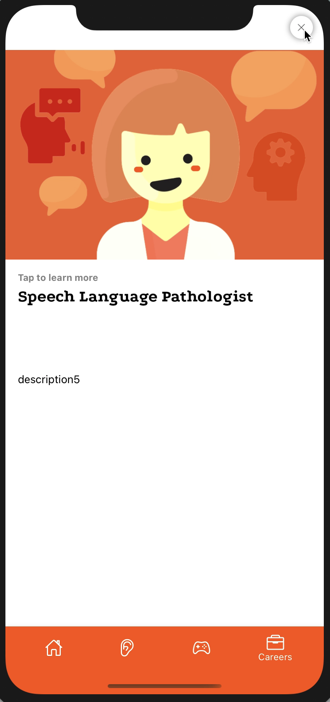

# HearHere 

## Background
* In children, nearly 60 percent of hearing loss is due to avoidable causes that could be prevented through public health measures (WHO, 2021). 15 percent of children have suffered permanent damage to their hearing from noise exposure (CDC, 2020). 
* These numbers can be exacerbated for rural areas that lack access to hearing healthcare education (Hay-McCutcheon et al., 2020), and the rise of social media platforms has only increased noise-induced hearing loss and tinnitus (Imam & Hannan, 2017).
* The future of rural healthcare is telehealth and technology (Struminger & Arora, 2019), especially during COVID-19 (Ameh et al., 2020; Mueller et al., 2021).
* There is a huge lack of diversity in hearing related fields (See Figure; ASHA, 2019)

## Goal
* Educate children on the structure of the ear, the importance of caring for your ears, and careers in the realm of hearing loss in a fun and interactive way.

## Intended Outcomes
* Filling the gap in terms of education for children in Alabama
* Preventing noise-induced hearing loss, especially with the huge surge in social media
* Increase diversity and exposure to other careers that may otherwise be unknown
* Decrease the stigma surrounding hearing aids and hearing loss - why aren’t they normalized like glasses?

## Technical Overview
* React Native iOS app
* Graphics created using Adobe Illustrator
* Four Screens: Home, Listen, Game, Careers

## Screens

### Home
The initial screen. Currently blank. Quick facts about hearing loss and the importance of the issue. An overview of the different pages. 




### Listen
Uses react-native sound library to measure the current metering of recorded audio in decibels. The elephant's emoiton and message reflects the safety of the sound.
* **<70 db:** "This level of sound is safe for your hearing!"
* * **<71-85 db:** "Sound at this level can damage your hearing after a few hours of listening."
* * **<85-100 db:** "Sound at this level can damage your hearing after a few minutes of listening."
* * **> 115 db:** "Sound at this level is damaging to your ears for any amount of time!!"

     


### Game
Users will be able to track a music note through an ear through a quiz/trivia game. This teaches kids the basic anatomy of the human ear in a fun and interactive way, and it can hopefully promote an interest in the sciences.

               


### Careers
Presents five different careers in modal format. Each person can be tapped on to reveal more about the position. The goal is to increase early interest in fields related to speech and hearing.
* Sound Engineer
* Audiologist
* Speech Language Pathologist
* Sign Language Interpreter
* Ear Nose Throat Doctor

     


## Running the App
* Clone the repository
```
cd ios
pod install
```
* If you're working on a mac, you will probably need to have Xcode installed
* Start the app with `npx react-native run-ios`
